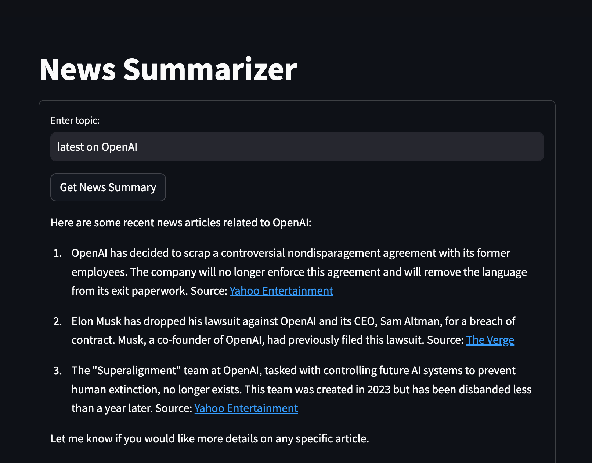

# News Summarizer Assistant

Streamlit App using the `OpenAI Assistants API` and the `News API`.



---

## How to run this project?

0. Prerequisites:

   - Make sure Python3 is installed.
   - If you don't have an account with OpenAI, create one here: https://openai.com/ then create a project API key under Dashboard / API keys.
   - Create an account for News API here: https://newsapi.org/

1. Clone the project.

2. Create a virtual environment inside the project folder:

   `python -m venv venv`

3. Activate the virtual environment:

   Mac: `source venv/bin/activate`

   Windows: `venv\Scripts\activate`

4. Install the python dependencies:

   `pip install -r requirements.txt`


5. Create an `.env` file in the root folder and add your project's API key:

   ```
   OPENAI_API_KEY=your-unique-opanai-project-key
   NEWS_API_KEY=your-unique-news-api-key
   ```

6. Run project in the integrated terminal:

   `streamlit run main.py`


## Credits


- OpenAI: https://openai.com
